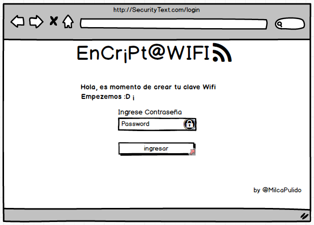
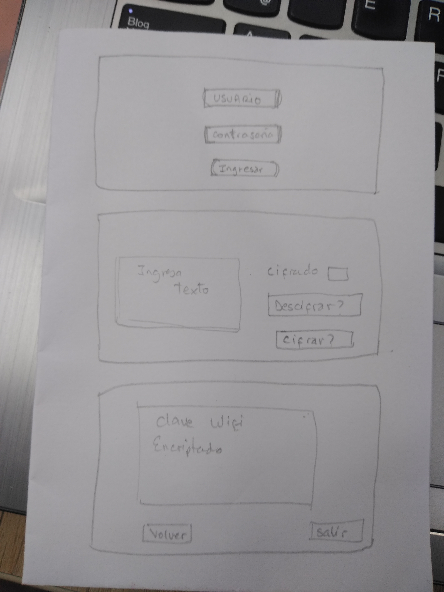

# EncriptaWIFI

## Resumen

Para alguna personas es tedioso crear Contraseñas de WIFI, no toman en cuenta la seguridad y utilizan contraseñas comunes y muy faciles de suponer que culaquier persona podrian acceder a su red.

### Bienvenida

  

### Ingreso de Texto
  

### Muestra el Resultado del Incriptado
  

**`INVESTIGACION UX`**:

  - **USUARIOS:** Personas que comparten internet,    con sus amigos o grupos de trabajo, que utilizan diferentes dispositivos.
  
  - **PRODUCTO:** Mediante la aplicacion el usuario tendra la facilidad de copiar contraseñas seguras para compartir su red con sus amigos, usando distintos desplazamientos e igresando un texto simple.

  - **PROTOTIPO EN PAPEL**
  
 
  - **RESUMEN :** Despues de consultar con mi Squad y 2 amigas de otro Squad, me recomendaron no considerar el usuario porque no tengo un grupo de usuarios especificos, ya que la aplicacion es libre, tambien considere agregar texto al inicio para que el usuario tenga nocion de que trata la aplicacion, mejore algunos botones y le di mas interaccion.

  -- **PROTOTIPO FINAL EN BALSAMIQ**
   

